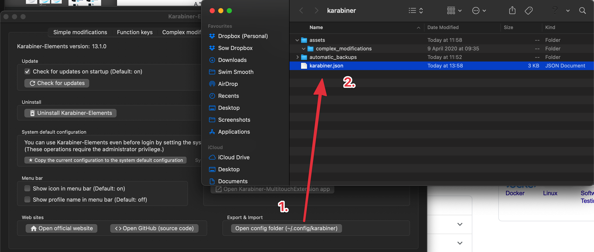
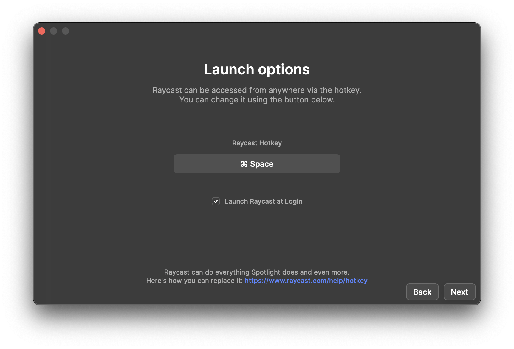

I'm trying out [Raycast](https://raycast.com) as a replacement launcher and script runner to Alfred for my Mac. 

For years now I've used [Alfred](http://alfredapp.com/) mapped to the Caps lock key for quick one-key access. As of the time of writing, Raycast thwarts this. Insisting you need at least one modifier key for your hotkey shortcut.

Here's how I got around that:

### 1. Disable the default ⌘+space Spotlight shortcut
Find it in System Preferences > Keyboard > Shortcuts > Spotlight

### 2. Download Karabiner Elements
It's a handy utility for remapping keys on your Mac. I used it already to map the caps-lock key to F13, to use as a hotkey for launching Alfred.

[Download it here](https://karabiner-elements.pqrs.org)

### 3. Open the Karabiner Elements settings.json
This is where you can get under the hood and add custom key remapping. Find this in the 'Misc' section of Karabiner



### 4. Add a new manipulator
Open the karabiner.json file in a text editor and add the following to the array (area between square brackets) under Profiles > rules > manipulators:

```
{
"description": "Change caps_lock to command+space",
"from": {
  "key_code": "caps_lock",
  "modifiers": {
    "optional": ["any"]
  }
},
"to": [
  {
    "key_code": "spacebar",
    "modifiers": ["left_command"]
  }
],
"type": "basic"
}
  ```

This remaps the caps_lock key to ⌘+space. We're now using a hotkey combination with a modifier key, so Raycast will accept it!

